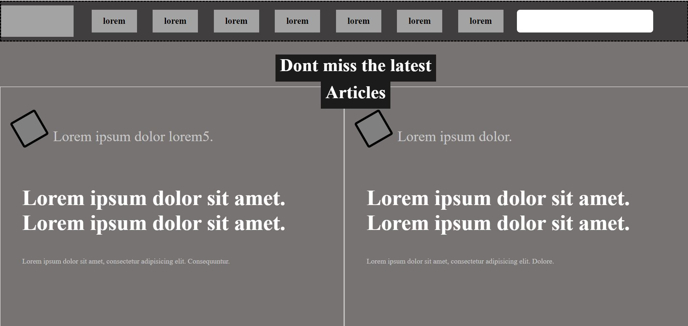

# Apple-Website
This project's purpose is to create a design teardown of https://www.smashingmagazine.com/

This project is made to test our understanding of UX and Typology.

## Built With

- HTML5, CSS3
- No frameworks are used in this project

## Live Demo

[Live Demo Link](https://rawcdn.githack.com/Berabjesus/Microverse-Design-Teardown/6820b769260fc57d720eaa54ad584de7ba86e638/index.html)

## Authors

👤 **Bereket Beshane**

- Github: [@berabjesus](https://github.com/Berabjesus)
- Twitter: [@bereket_ababu_b](https://twitter.com/bereket_ababu_b)
- Linkedin: [linkedin](https://www.linkedin.com/in/bereket-beshane-a1b75a1a9/)

👤 **Juan Ignacio Asis**

- Github: [@KennyUTN](https://github.com/KennyUTN)
- Twitter: [@Kenny11614766](https://twitter.com/Kenny11614766)
- Linkedin: [linkedin](https://www.linkedin.com/in/ignacio-asis-b8214b183/)

## 🤝 Contributing

Contributions, issues, any kind of feedback and feature requests are welcome!

## Show your support

Give a ⭐️ if you like this project!

## Acknowledgments

- On this website we worked on giving backgrounds to containers.

## 📝 License

This project has no license
